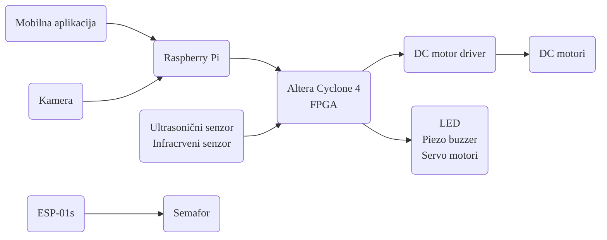

# Opis projekta
Tema projekta je automobil koji se kontroliše putem mobilne aplikacije.
Automobil će imati 4 točka, 2 kočnice, parking senzore, LED svjetla, sposobnost detektovanja svjetla na semaforu, saobraćajnih znakova, prevenciju prelazka preko linije, itd.
Mobilna aplikacija će biti napisana u Kotlin programskom jeziku koristeći Android Studio i Jetpack Compose.
Komunikacija između mobilne aplikacije i Raspberry Pi će se odvijati putem HTTP protokola.
Komunikacija između Raspberry Pi i FPGA će se odvijati putem nekog serijskog transfer protokola (UART, I2C, SPI ili USB).

# Hardver sa tabelom ulaza i izlaza
| Upravljačke ploče       | Slika |
| ----------------------- | ----- |
| Raspberry Pi 4          |  |
| Altera Cyclone 4 (FPGA) |  |
| ESP-01s                 |  |

| Ulazi                             | Upravljačka ploča | Namjena                          | Slika |
| --------------------------------- | ----------------- | -------------------------------- | ----- |
| Ultrasonični senzor (HC-SR04P) x2 | FPGA              | Parking senzori                  |  |
| Kamera (Logitech C512)            | Raspberry PI      | Detekcija znakova i video stream |  |
| Infracrveni senzor x2             | FPGA              | Detekcija linija                 |  |

| Izlazi               | Upravljačka ploča | Namjena                  | Slika |
| -------------------- | ----------------- | ------------------------ | ----- |
| DC motori x4         | FPGA              | Kontrola kretanja        |  |
| Servo motori x2      | FPGA              | Kočnice                  |  |
| Aktivni piezo buzzer | FPGA              | Zvučna signalizacija     |  |
| LED (nekoliko)       | FPGA              | Svjetlosna signalizacija |  |

| Dodatno                  | Upravljačka ploča | Namjena                  | Slika |
| ------------------------ | ----------------- | ------------------------ | ----- |
| DC motor driver L298N x2 | FPGA              | Kontrola motora          |  |
| LED semafor              | ESP-01s           | Svjetlosna signalizacija |  |

# Dijagram upravljanja

Raspberry Pi će uzimati video stream od kamere i pomoću AI detektovati koje je svjetlo upaljeno na semaforu, kao i STOP znak.
Taj video stream će također slati na mobilnu aplikaciju.
Mobilna aplikacija će slati kontrolne signale (kretanje, kočenje i zvučni signal) na Raspberry Pi koji će dalje te signale proslijediti do FPGA.
FPGA će uzimati i procesirati signale sa Raspberry Pi, ultrasoničnih i infracrvenih senzora, i procesirati ih.
Nakon procesiranja signala će slati kontrole signale ostalim komponentama kao što su LED na autu, piezo buzzer, servo motore i DC motor driver koji će dalje pokretati DC motore na koje su pričvršćeni točkovi.

